# Set Up Jenkins Configuration in the Web Interface

## Description

With Jenkins installed and NGINX configured as a reverse proxy, the final step is to complete the initial setup through the Jenkins web interface.

In this guide, you will:

- Complete the initial Jenkins setup.
- Create the administrator account.
- Configure the Jenkins URL.
- Add SSH credentials for the worker node.
- Register the Linux worker node.
- Configure Jenkins to execute builds only on the worker node.

---

## Steps

### Step 1: Access the Jenkins Web Interface

Open a web browser and navigate to:

```text
http://<JENKINS_CONTROLLER_IP>/
```

Since NGINX is listening on **port 80**, the request is first received by NGINX and then internally forwarded to the Jenkins service running on **127.0.0.1:8080**.

---

### Step 2: Unlock Jenkins

The first time Jenkins starts, it prompts you to unlock the installation using the initial administrator password.

Retrieve the password from the controller server.

```bash
sudo cat /var/lib/jenkins/secrets/initialAdminPassword
```

Copy the password and paste it into the Jenkins setup page.

---

### Step 3: Install the Recommended Plugins

After unlocking Jenkins, choose:

**Install suggested plugins**

Jenkins will automatically download and install the recommended plugins required for most CI/CD workflows.

---

### Step 4: Create the Administrator Account

After the plugins have been installed, Jenkins prompts you to create a new administrator account.

Provide the required details:

- Username
- Password
- Full name
- Email address

Click **Save and Continue**.

Once complete, the Jenkins dashboard will open.

---

### Step 5: Configure the Jenkins URL

From the Jenkins dashboard, navigate to:

**Manage Jenkins**

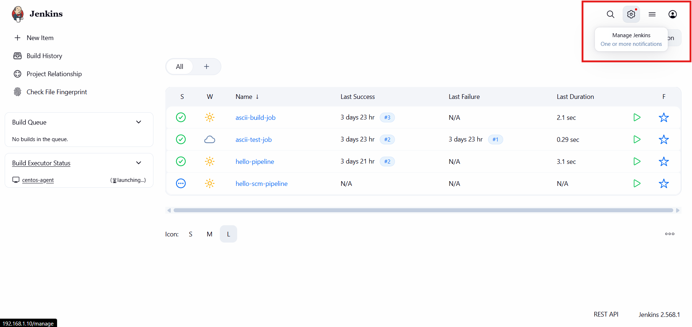

Select:

**System**

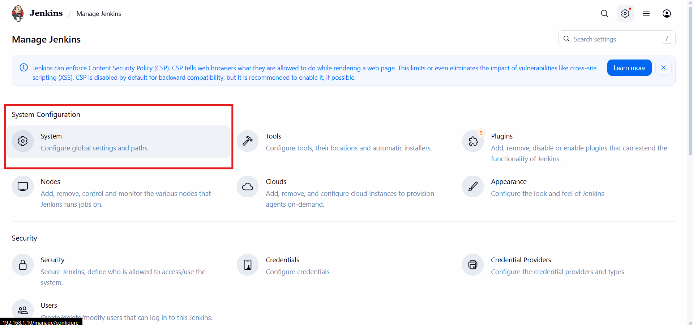

Under **Jenkins Location**, set the **Jenkins URL** to the URL or IP address of your controller server.

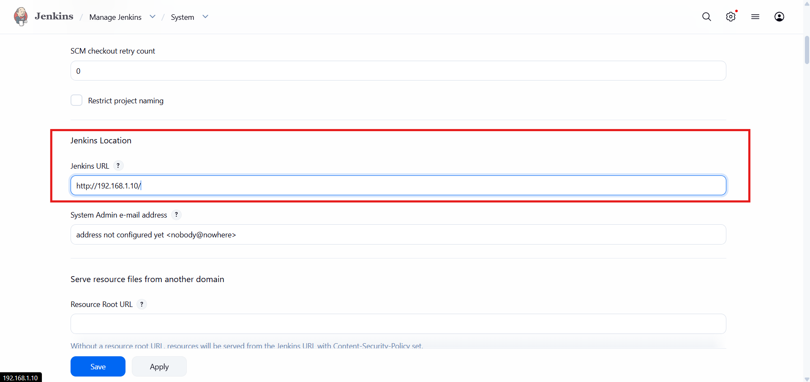

Click **Save**.

---

### Step 6: Add SSH Credentials

The controller requires SSH credentials to connect to the worker node.

Navigate to:

**Manage Jenkins → Credentials**

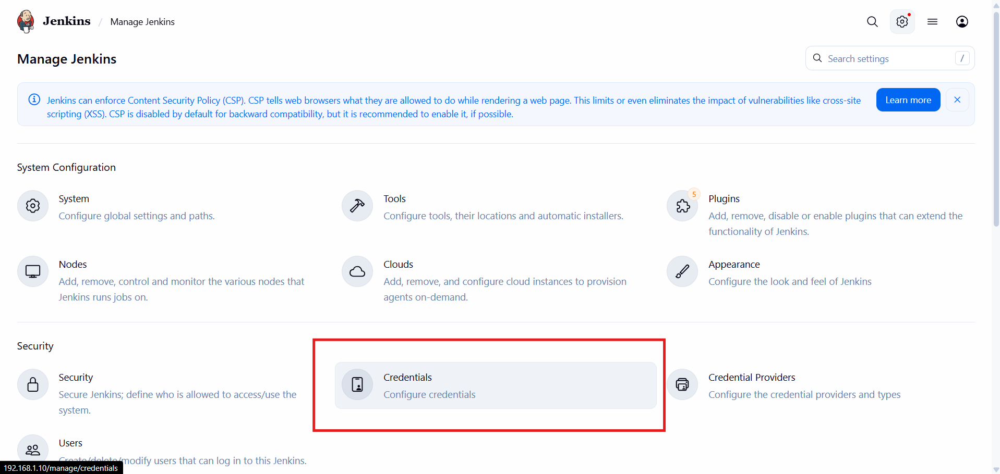

Click:

**Add Credentials**

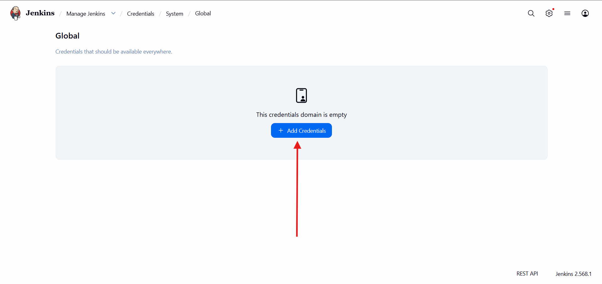

Choose:

- **Kind:** SSH Username with private key

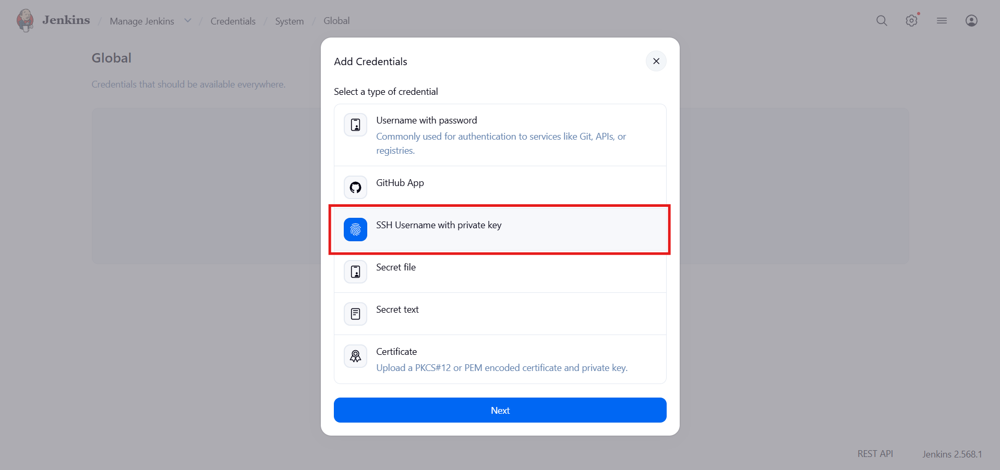

Enter:

- **Username:** `jenkins`
- **Private Key:** Paste the private key from the controller.

You can retrieve the private key on the controller using:

```bash
sudo cat /home/jenkins/.ssh/id_ed25519
```

> **Note:** Paste only the contents of the private key into the Jenkins credential.

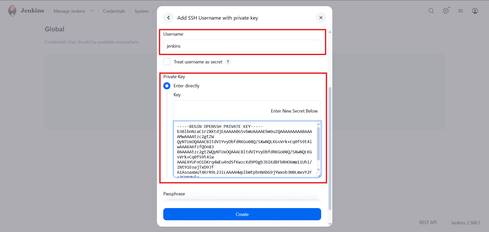

Save the credential.

---

### Step 7: Add the Worker Node

Return to:

**Manage Jenkins**

Select:

**Nodes**

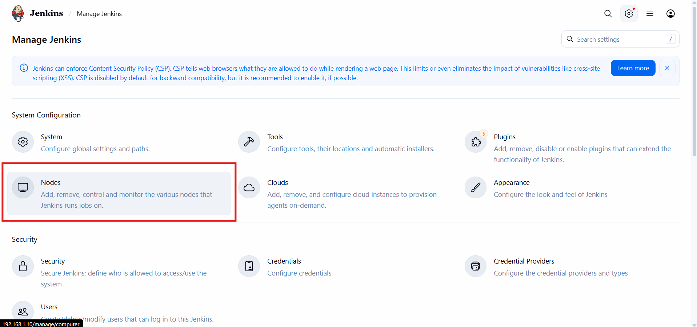

Click:

**New Node**

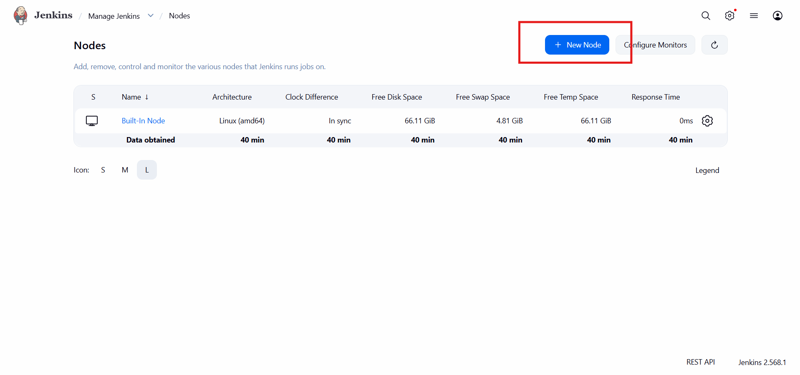

Provide a name for the worker node and select:

**Permanent Agent**

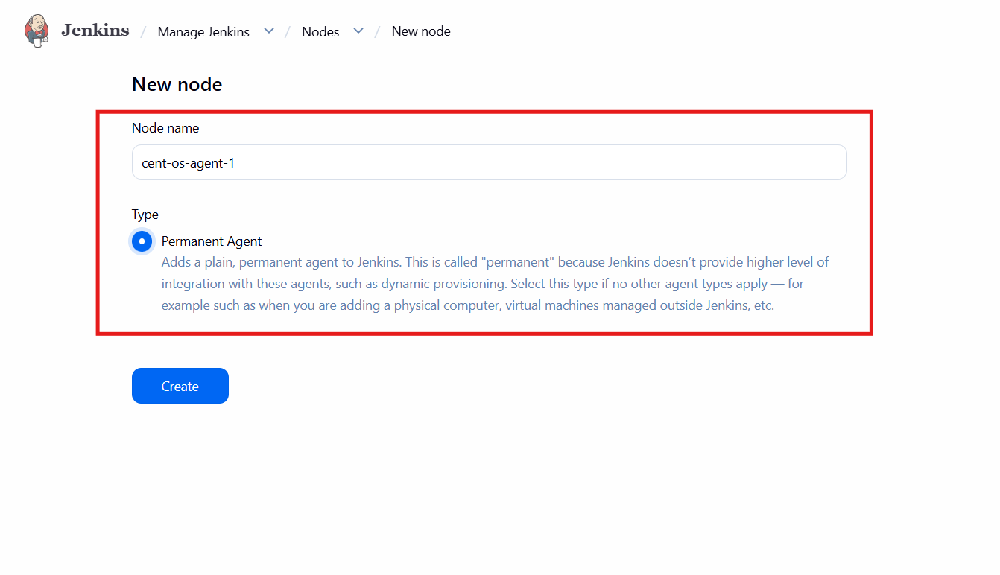

Click **Create**.

---

### Step 8: Configure the Worker Node

Fill in the required details such as:

- Number of executors
- Remote root directory
- Labels


Next, configure:

- Launch method
- Host address
- SSH credentials
- Host Key Verification Strategy (Known Hosts Verification Strategy)

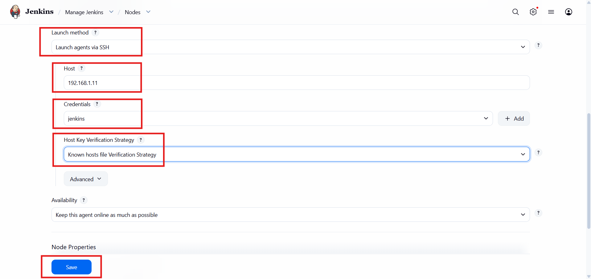

Click **Save**.

Jenkins will now connect to the worker node over SSH and install the required agent components automatically.

---

### Step 9: Disable Builds on the Built-in Node

To ensure all builds are executed on the dedicated worker node, disable executors on the built-in controller node.

Navigate back to:

**Manage Jenkins → Nodes**

Select the **Built-In Node**, click the **Settings** (gear) icon, and set:

```text
Number of executors = 0
```

Save the configuration.

This prevents Jenkins from scheduling builds on the controller while still allowing it to manage pipelines and connected agents.

---

## Conclusion

You have successfully completed the Jenkins web-based configuration, configured the controller URL, added SSH credentials, registered a Linux worker node, and configured Jenkins to execute builds exclusively on the worker node.

Your distributed Jenkins environment is now ready to run CI/CD pipelines securely and efficiently.

---

## Next Steps

➡️ **[Run a Demo Pipeline](./07-run-demo-pipeline.md)**