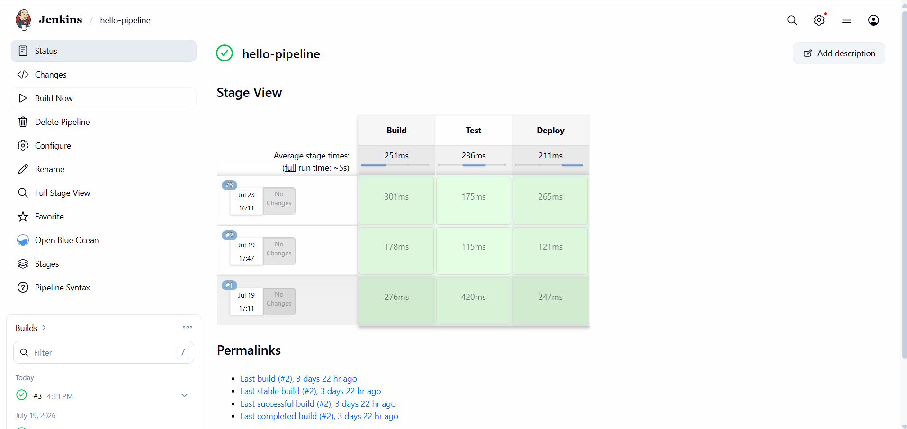
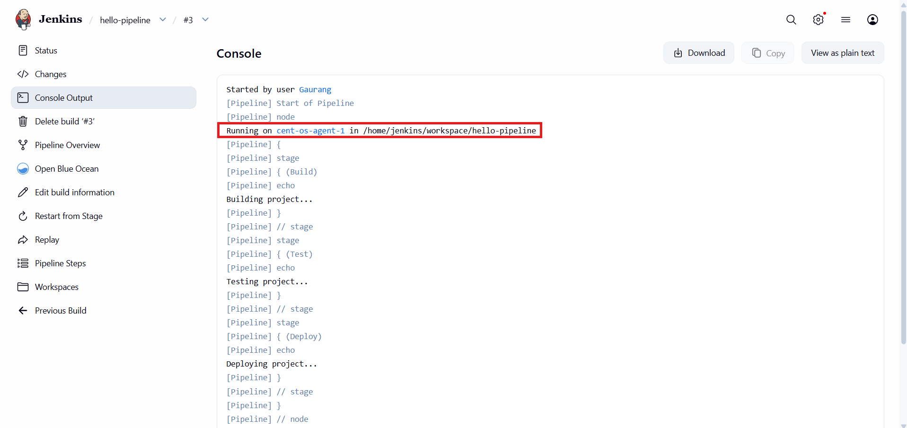

# Run Your First Pipeline

## Description

Now that the Jenkins controller and Linux worker node have been configured, it's time to verify that the setup is working correctly by creating and running a simple pipeline.

In this guide, we will create a basic Declarative Pipeline with three stages: **Build**, **Test**, and **Deploy**. Since the pipeline uses `agent any`, Jenkins will automatically schedule the build on one of the available agents. Because we disabled executors on the built-in controller node, the pipeline will run on the dedicated worker node.

---

## Steps

### Step 1: Create a New Pipeline

From the Jenkins dashboard, click:

**New Item**

Give the pipeline a name, for example:

```text
hello-pipeline
```

Select:

**Pipeline**

Click **OK**.

---

### Step 2: Configure the Pipeline

Scroll down to the **Pipeline** section.

For **Definition**, select:

```text
Pipeline script
```

Replace the existing script with the following:

```groovy
pipeline {
    agent any

    stages {
        stage('Build') {
            steps {
                echo 'Building project...'
            }
        }

        stage('Test') {
            steps {
                echo 'Testing project...'
            }
        }

        stage('Deploy') {
            steps {
                echo 'Deploying project...'
            }
        }
    }
}
```

Click **Save**.

---

### Step 3: Run the Pipeline

Click:

**Build Now**

Jenkins will queue the pipeline and execute it on the configured worker node.

If everything has been configured correctly, the pipeline should complete successfully.



---

### Step 4: Verify the Build

Open the completed build and select:

**Console Output**

You should see output similar to:

```text
Building project...
Testing project...
Deploying project...
```

The console output also indicates which node executed the pipeline, confirming that the build was run on the configured worker node instead of the built-in controller.



---

## Conclusion

Congratulations! You have successfully configured a distributed Jenkins environment with a dedicated controller and Linux worker node.

You installed Jenkins, configured an NGINX reverse proxy, established secure SSH communication between the controller and the worker, connected the worker node through the Jenkins web interface, and executed your first pipeline.

This setup serves as a solid foundation for building more advanced CI/CD workflows, integrating source control systems, running automated tests, and deploying applications.